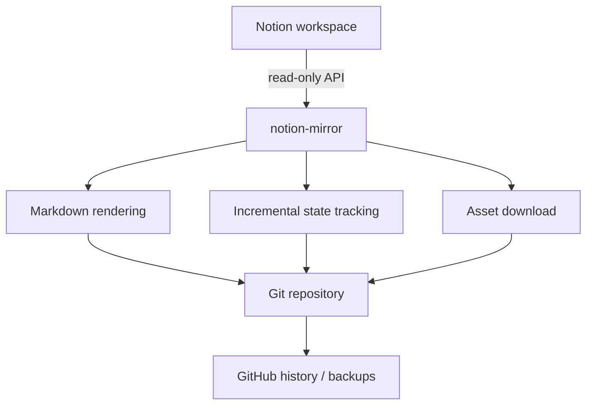

# Notion Mirror


Read-only synchronization of Notion pages into a Git-backed Markdown mirror
of your workspace.

Every sync becomes a Git commit — giving you version history, diffs, backups,
and long-term ownership of your notes outside Notion.

Built entirely on Notion's official read-only API. No browser automation,
cookies, scraping, or unofficial export endpoints.

## Why not just use Notion's "Export all workspace content"?

Notion's built-in export gives you a one-time ZIP. This project turns
that into a living, versioned mirror instead:

- **Every sync is a Git commit.** `git diff` shows exactly what changed
  across your whole workspace in one place, instead of checking each
  page's version history separately.
- **No manual export ritual.** Scheduled via GitHub Actions, it just
  happens — no clicking through Settings → Export and unzipping a fresh
  file every time you want a snapshot.
- Your repo stays close to current on its own schedule, not just
  whenever you remember to export.
- Notion permanently empties Trash after 30 days. A page deleted there
  can still be recovered from an old Git commit, since this repo's
  history lives independently of Notion.
- **Plain Markdown, not a ZIP.** Greppable, diffable, portable — works
  with any tool that reads Markdown.

## Architecture



## Example

A Notion workspace like this:

```text
Engineering Handbook
├── Onboarding
│   └── Local Development
└── Architecture
```

becomes:

```text
notes/
  Engineering Handbook/
    index.md
    Onboarding/
      index.md
      Local Development/
        index.md
    Architecture/
      index.md
```

Every page gets its own folder (with its own `assets/` for downloaded
images/files), so a page can gain children later without anything being
restructured.

## See it in action

A real Notion page
([screenshot](<examples/real-notion/🪞 Notion Mirror Demo Page.png>))
next to the exact, unedited Markdown this tool generated from it
([`index.md`](<examples/backup/🪞 Notion Mirror Demo Page/index.md>)) —
nested lists, to-dos, a quote, a callout, a toggle, a table, an image,
a file attachment, a child page, and more. Notice the backup's folder
name matches the page's real title, exactly as it would in your own
mirror.

## Features

- Read-only access to every page shared with the integration, including
  nested child pages (database rows skipped for now)
- Markdown export covering paragraphs, headings, nested lists, to-dos,
  quotes, callouts, toggles, code, tables, and links — see
  [Current limitations](#current-limitations) for what doesn't
  round-trip perfectly
- Images and files downloaded locally, including inline pasted images,
  instead of linking Notion's temporary URLs
- Incremental sync via `.notion-sync/state.json` — only touches pages
  that changed, moved, or were renamed, and cleans up deleted/unshared
  ones
- One page failing (a filesystem limit, a malformed block) never aborts
  the rest of a large sync
- A GitHub Actions workflow that auto-commits back to the repo,
  manually triggered by default and easy to put on a cron in your own
  fork (see [Automate with GitHub Actions](#4-automate-with-github-actions))

## Current limitations

Being upfront about what this doesn't do yet:

- **Database rows aren't exported yet** — only regular pages and their
  children. Notion databases are a different object type and need their
  own row-to-Markdown mapping (see [Roadmap](#roadmap)).
- Notion's discussion comments aren't exported, only page content.
- Notion's sharing/permissions aren't mirrored — repo access means
  access to everything in it, regardless of who could see what in
  Notion.
- A few Notion-only constructs are approximated: toggles become
  `<details>` HTML (fine on GitHub, shows as literal tags if pasted back
  into Notion), colors/highlighting are dropped, columns flow
  sequentially, and live widgets like table-of-contents/breadcrumbs are
  omitted.
- **Sequential today**, one page at a time. Notion caps any integration
  around 3 requests/second regardless of concurrency, so this mainly
  matters for very large workspaces — bounded concurrent fetching is
  planned, not built prematurely.
- No committed test suite yet — verified so far with targeted manual
  scripts during development, not automated regression tests.
- Two overlapping invocations against the same directory can race at a
  "last write wins" level — state writes are atomic so the file itself
  won't corrupt, but a double-trigger isn't fully guarded against.
- A failed asset download degrades silently — the page still exports,
  just falling back to Notion's original (expiring) URL for that one
  file, and won't retry until the page is next edited.

## Roadmap

**Done:**
- GitHub Actions workflow for automated sync (schedule is opt-in per
  fork — see [Automate with GitHub Actions](#4-automate-with-github-actions))

**Planned:**
- Bounded concurrent fetching for large workspaces (sized to Notion's
  own rate limit)
- Optional database (table) export
- A committed automated test suite

Not on the roadmap: writing back to Notion. This project is read-only by
design, not just by default — see [Security](#security).

## Setup

### 1. Create a Notion integration and get a token

Notion occasionally reshuffles this UI — if these exact steps drift,
search "Notion create internal integration" for the current flow.

1. Go to [notion.so/my-integrations](https://www.notion.so/my-integrations)
   while logged into your workspace.
2. Click **+ New integration**, name it, pick your workspace, and leave
   the capability set to **Read content** only — this tool never writes
   back to Notion.
3. Copy the **Internal Integration Secret** and put it in a `.env` file
   at the project root:

   ```
   NOTION_TOKEN=secret_xxx...
   ```

### 2. Share the pages you want synced

Notion integrations can only see pages explicitly shared with them —
there's no "share entire workspace" switch in the Notion API. Sharing a
page also shares everything nested under it, so you only need to do
this once per **top-level** page, not every sub-page: open it → `•••` →
**Connections** → add your integration. See the [FAQ](#faq) below for
how to handle a large number of top-level pages.

### 3. Install & run

```
pip install -e .
notion-mirror
```

### 4. Automate with GitHub Actions

A workflow at [`.github/workflows/sync.yml`](.github/workflows/sync.yml)
can run the sync for you:

1. Push this repo to GitHub, if you haven't already.
2. Add your token as a repository secret: **Settings → Secrets and
   variables → Actions → New repository secret**, named `NOTION_TOKEN`.
3. Trigger it anytime from the **Actions** tab.

By default the workflow only runs on that manual trigger — deliberately,
since this repo is a public template and forks never inherit secrets, so
nothing runs for anyone until they configure their own `NOTION_TOKEN`.
To sync on a schedule instead (e.g. in your own private fork, once your
secret is set), uncomment and add a `schedule` block in that file — cron
times are always UTC, and [crontab.guru](https://crontab.guru) is a fast
way to build or sanity-check an expression.

A few things worth knowing once a schedule is enabled: GitHub
automatically disables a scheduled workflow after 60 days with no
repository activity (a GitHub-wide policy, not something this workflow
controls) — a manual run from the Actions tab re-enables it. If the
default branch has branch protection rules requiring reviewed pull
requests, the workflow's direct push will fail; this workflow assumes a
normal, unprotected default branch. And if you gitignore `notes/` or
`.notion-sync/`, the workflow will keep running but never actually
commit anything — `git add` refuses to stage explicitly-ignored paths,
so each run's output is just discarded. Not a bug, just standard
`.gitignore` behavior.

## FAQ

#### I want this to actually back up my own workspace automatically — what should I do?

Don't configure your real `NOTION_TOKEN` on this public repo. Keep this
one as the tool/template, and run your own copy in a separate, genuinely
private repo — your own token and an enabled schedule live there
instead, so your actual notes never end up in a public place.

#### I have a lot of top-level private pages — do I have to share each one individually?

Yes, once each, unless you'd rather restructure — Notion has no bulk
"share everything" action, by design. Either share every existing
top-level page once (sidebar unchanged, just a permission grant), or
consolidate them under one new root page first and share only that
(fewer pages to share, but it does restructure your sidebar).

#### What happens if I delete a page in Notion?

Its local folder is removed on the next sync — recoverable from Git
history even after Notion's own Trash empties.

#### What happens if I rename or move a page in Notion?

Its local folder is renamed/relocated to match, and `state.json` is
updated accordingly.

## Security

This tool only ever needs Notion's **Read content** capability — it has
no code path that writes to Notion, and none is planned (see
[Roadmap](#roadmap)).

Your `NOTION_TOKEN` is a credential: keep it in `.env`, which is already
listed in `.gitignore`, and never commit it to Git. If a token is ever
exposed, revoke it from [notion.so/my-integrations](https://www.notion.so/my-integrations)
and issue a new one.

## Contributing

Contributions, bug reports, and feature requests are welcome. Please
open an issue before starting on a large architectural change, so we
can agree on the approach first.

## License

[MIT](LICENSE)
