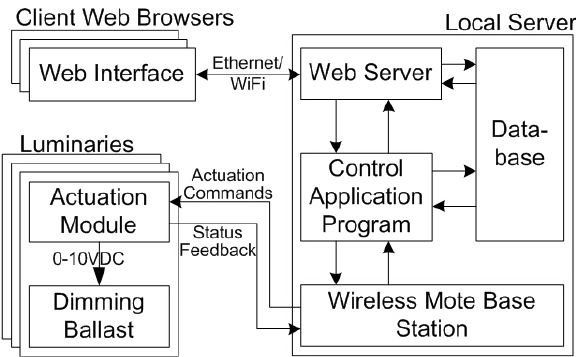

# 🪞 Notion Mirror Demo Page

> A sample page demonstrating how Notion Mirror exports common Notion blocks to Git-backed Markdown.

---

# Overview

Notion Mirror converts Notion content into a version-controlled Markdown repository.

Because every sync becomes a Git commit, changes are easy to diff, search, back up, and recover.

> 💡 **Tip:** This page intentionally contains many different Notion block types so you can verify export fidelity.

---

# Text Formatting

This paragraph contains **bold**, *italic*, ~~strikethrough~~, `inline code`, and a [https://developers.notion.com](https://developers.notion.com/).

You can also mix **bold and ****`inline code`**** together** inside the same sentence.

---

# Headings

## Heading Level 2

### Heading Level 3

<!-- Unsupported block: heading_4 -->

Useful for validating Markdown heading rendering.

---

# Bulleted Lists

- Machine Learning
    - Quantization
        - INT8
        - FP16
    - Distillation
- Distributed Systems
    - Consensus
    - Fault Tolerance
- Platform Engineering

---

# Numbered Lists

1. Collect data
1. Deploy service
    1. Staging
    1. Production

---

# To-Do List

- [x] Create Notion integration
- [x] Enable Read Content capability
- [x] Share root page
- [x] Sync workspace
- [ ] Export database rows
- [ ] Add automated tests

---

# Quote Block

> Simplicity is prerequisite for reliability.
>
> — Edsger W. Dijkstra

---

# Callout

💡 **Notion Tip:** Use one shared root page for all notes if you want to minimize manual sharing with the integration.

---

# Toggle Example

### Experimental Results

<details>
<summary>Toggle block:</summary>

- Accuracy improved after INT8 calibration.
- Inference latency reduced significantly.
- Memory usage decreased.

</details>

---

# Code Blocks

```python
print("Demo page")
```

---

# Table Example

| Feature | Supported |
| --- | --- |
| Paragraphs | ✅ |
| Headings | ✅ |
| Nested Lists | ✅ |
| Images | ✅ |
| Code Blocks | ✅ |
| Tables | ✅ |
| Database Rows | ❌ |

---

# Image Example



*Architecture Overview*

---

# File Attachment Example

[Download file](assets/3d64a2d6-70be-8091-86d1-ee8444be6b8b.pdf)

---

# Child Pages

[Mirror Sub Page](Mirror%20Sub%20Page/index.md)

---

# Embedded Link

Embed:

[https://github.com/notionhq/client](https://github.com/notionhq/client)

---
